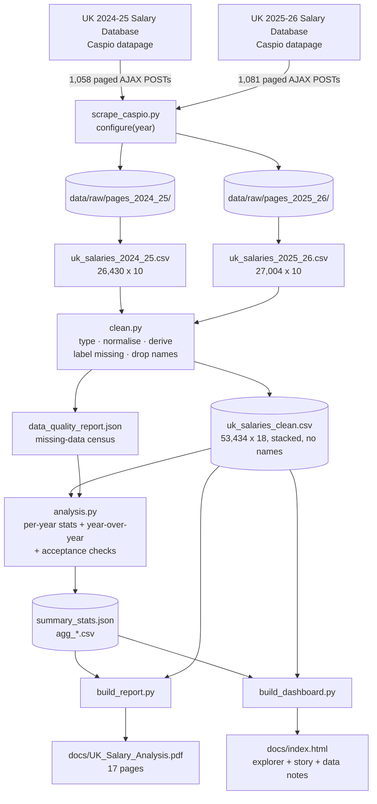

# Technical Documentation — V2

Project: **Anatomy of a Public Payroll — University of Kentucky Salaries**
Author: **Shiva Kumar P** · [LinkedIn](https://www.linkedin.com/in/shivakumar-p-/) · [GitHub](https://github.com/ShivaKumar8037)
Data retrieved: **2026-08-04** · Years covered: **2024-25, 2025-26** · Records: **53,434** (26,430 + 27,004)

This document covers where the data came from, how it moves through the pipeline,
what every field means, how missing data is handled, which judgement calls were
made and why, and what the dataset cannot support.

---

## 0. What changed in V2

| | V1 | V2 |
|---|---|---|
| Years | 2024-25 only | **2024-25 and 2025-26**, with year-over-year analysis |
| Records | 26,430 | **53,434** across both years |
| Missing data | Counted internally | **Stated explicitly** in the dashboard, the report, and here — with `Not applicable` separated from `Not reported` |
| Full-time / part-time | Segmented in analysis | **Encoded as a fixed colour pair with a legend** on every chart where both appear |
| Narrative | Reader had to interpret the charts | **Six-chapter story section** with its own supporting visualisations |
| Styling | Neutral palette | **University of Kentucky brand** — Wildcat Blue, Mercury/Avenir type stack |
| Attribution | None | Author credit and links in both deliverables |


---

## 1. Data flow



**Design rule:** no statistic is hardcoded in a plotting script. `analysis.py`
computes every figure into `summary_stats.json`; the report and dashboard read
from it. The narrative cannot drift away from the data.

---

## 2. Source and extraction method

The university publishes each salary year as a separate **Caspio "Search and
Report" datapage**, all on the same account and all sharing one ten-column schema.
There is no export button, no download link, and no public API.

| Year | App key | Records | Pages |
|---|---|---|---|
| 2024-25 | `be542000f51b67c67dbd45399571` | 26,430 | 1,058 |
| 2025-26 | `be542000f9ee31dd817a4a8c9f2e` | 27,004 | 1,081 |

Three mechanics had to be reverse-engineered:

| # | Behaviour | Consequence |
|---|---|---|
| 1 | The public URL returns a 419-byte wrapper containing only a `<script>` tag. Real content is served only when the request carries a `cbqe=` parameter (base64-encoded embed settings) or a `?rnd=<ms>` cache-buster. | A plain `GET` on the visible URL returns nothing usable. |
| 2 | Pagination returns **JSON, not HTML** — `{appSession, responseText, totalRecords, totalPageCount, pageCurrent, pageSize}`, where `responseText` holds one page of `<tr>` markup. | More robust than scraping a rendered page; row counts are self-verifying. |
| 3 | **`appSession` rotates on every response.** Each reply issues a fresh token that must be carried into the next request. | Reusing the initial token breaks the walk partway through. This is the detail that defeats a naive scraper. |

### Request sequence

```
GET  /dp/<key>                                  prime cookies (AWSALB, cbCookieAccepted)
GET  /dp/<key>?cbqe=<base64>&cbEmbedTimeStamp=  datapage payload; extract the two
                                                _[0-9a-f]{14} section ids
                                                ([0] = search form, [1] = results)
POST /dp/<key>?rnd=<ms>                         AjaxAction=SearchForm, all Value*_1 blank,
                                                cbSpaInitialSearch=True
                                                -> JSON, yields first appSession
POST /dp/<key>?rnd=<ms>   xN                    AjaxAction=GetData, CPIPage=N,
                                                appSession=<rotating token>
```

Bodies must be **multipart/form-data**; form-urlencoded posts are rejected with
the wrapper shell.

### Notes

- **Blank search returns everything.** All six criteria submitted empty match every record.
- **Page size is locked at 25 server-side.** `cbCurrentPageSize` values of 200, 500
  and 2000 were each tested; all accepted and silently ignored.
- **Cell parsing.** Each `<td>` embeds a responsive label:
  `<td><span class="cbResultSetLabel">Last Name:</span>Aaron</td>`. The label span
  is removed before reading cell text — stripping tags naively yields `"Last Name:Aaron"`.
- **Politeness and resilience.** 0.30–0.55 s randomised delay; exponential backoff;
  automatic session re-bootstrap if a response arrives without result markup. Each
  page is cached, so an interrupted run resumes rather than restarting.
- **Observed runtime:** 659 s (2024-25) and 680 s (2025-26).

Adding a future year means one line in `DATASETS` — nothing else changes.

---

## 3. Data dictionary

### Source fields (as published, identical across both years)

| Field | Type | Notes |
|---|---|---|
| `LastName`, `FirstName` | text | Present in the source. **Dropped during cleaning** — see §5. |
| `AdministrativeUnitOrCollege` | text | 34 distinct values. Top level of the org hierarchy. |
| `Department` | text | 765 distinct values (2025-26). Not strictly nested under unit. |
| `JobTitle` | text | 3,535 distinct values (2025-26). |
| `Position` | text | Often equal to `JobTitle`; for faculty it carries the academic rank. |
| `EEO` | text | 8 federal occupational categories. |
| `Rank` | text | Academic rank. **Blank for most records — see §4.** |
| `FullOrPartTime` | text | `Full Time` / `Part Time`. |
| `SalaryTrueAnnual` | currency text | e.g. `$129,305.00`. FTE-adjusted annual **base** salary. |

### Derived fields (`uk_salaries_clean.csv`)

| Field | Type | Derivation |
|---|---|---|
| `year` | text | `2024-25` or `2025-26`. |
| `unit`, `department`, `job_title`, `position`, `eeo_category`, `time_status` | text | Renamed, whitespace-normalised; empty values become `Not reported`. |
| `faculty_rank` | text | Source rank, or `Not applicable` / `Not reported` — see §4. |
| `rank_status` | text | `Reported` / `Not applicable` / `Not reported`. |
| `salary` | float | `$` and `,` stripped. |
| `salary_band` | ordered category | 9 bins: Under $25k → $500k+. |
| `is_full_time`, `is_faculty` | bool | From `time_status` / `eeo_category`. |
| `is_resident` | bool | Title or position matches `\bI/R/F\b` or `\bPGY\s*-?\s*\d`. |
| `is_research`, `research_category` | bool / text | See §4. |
| `has_complete_record` | bool | No `Not reported` in any analysed field and salary parsed. |
| `appointment_count_for_name` | int | How many records share this record's name, within its year. Diagnostic only. |

---

## 4. Missing data — stated, not filled

**Every analysed field is fully populated in both years, with one exception:
academic rank.** That single exception is genuinely interesting, because it is
blank for two different reasons and the difference matters.

| Rank status | 2024-25 | 2025-26 | Meaning |
|---|---|---|---|
| `Reported` | 4,594 | 4,791 | An academic rank is published. |
| `Not applicable` | 21,814 | 22,202 | The role has no academic rank — a nurse, a custodian, an analyst. The source is **correct** to leave it blank. |
| `Not reported` | **22** | **11** | A record classified as Faculty with **no rank published**. A genuine gap. |

Collapsing those two into "21,836 missing values" would be misleading: it would
imply a data-quality problem roughly a thousand times larger than the real one.

Rules applied throughout:

- Empty categorical values become the literal label **`Not reported`** and appear
  as their own category in every chart. They are never dropped, never merged into
  a real value, and never silently imputed.
- `Not reported` carries a deliberately colourless swatch so it cannot be mistaken
  for a substantive category.
- The dashboard's **Data notes** section prints the missing-field census per year
  straight from `data_quality_report.json`, so the claim is auditable rather than
  asserted.

### Research workforce classification

Roles are matched on job title + department, **most specific pattern first**,
first match wins. Residents and fellows are excluded even when their department
name mentions research — they are clinical trainees, not research staff.

| Category | Matched on | 2025-26 |
|---|---|---|
| Research Administration | `research admin`, `sponsored projects/programs`, `grants admin/manager/specialist/officer`, `research compliance`, `proposal development`, `research analyst/facilitator/integrity`, plus anyone in the `Research Administration` unit | ~980 |
| Research Support Staff | `research associate/assistant/technician/technologist/specialist`, lab roles, `\bresearch\b` fallback | ~830 |
| Research Faculty/Scientist | `research scientist`, `scientist`, `research professor` | ~370 |
| Postdoctoral | `post doc` / `postdoc` variants | 276 |
| Clinical Research | `clinical research`, `research nurse`, `study coordinator`, `research coordinator` | ~210 |
| **Total** | | **2,619** (9.7% of headcount) |

**This is a heuristic, not an official designation.** UK publishes no
research-workforce flag. The rule set is transparent and reproducible, but it will
miss research staff with generic titles and may capture roles whose research
content is incidental.

---

## 5. Decision log

| Decision | Rationale |
|---|---|
| **Names dropped; no individual identified anywhere.** | The source is public record and does contain names, but nothing in the analysis requires identifying a person. Top-of-scale roles are labelled by job title + unit. |
| **No demographic inference.** | The dataset carries no gender, race or age fields. Estimating them from names is unreliable and would not support defensible conclusions. |
| **`Not applicable` separated from `Not reported`.** | See §4. Merging them would overstate the gap by three orders of magnitude. |
| **Records, not people.** | An employee with two appointments appears twice. Name-collision counts approximate headcount but are never reported as an exact person count. |
| **Part-time separated from full-time everywhere, with a fixed colour and a legend.** | `SalaryTrueAnnual` is FTE-adjusted, so a half-time employee shows half a salary. 7,393 records (27%) are part-time in 2025-26. Pooling them drags every average down. |
| **Faculty rank medians restricted to full-time.** | Including part-time adjuncts put the `Instructor` median at $14k — a figure describing appointment fraction, not the pay ladder. |
| **Medians, not means, for group comparisons.** | The distribution is strongly right-skewed (Gini 0.407). |
| **Matched job titles as the year-over-year control.** | A rising median also rises when the mix of roles changes. Comparing the same title in both years separates real pay movement from composition. |
| **Nominal dollars.** | No inflation adjustment is applied; year-over-year figures are nominal and labelled as such. |
| **Departmental dispersion floored at 30 full-time staff.** | Below that, one outlier dominates the p90/p10 ratio. |
| **Log scale on distribution charts.** | Salaries span roughly five orders of magnitude. |
| **Wildcat Blue is chrome, not a data fill.** | `#0033A0` fails the categorical lightness band outright when measured against the chart surface. Data marks use `#1b52c4`, a lighter step of the same hue that passes every gate. See §8. |
| **Every PDF page links to the dashboard.** | The PDF travels on its own — emailed, printed, downloaded from a search result — and a reader who has only the PDF has no other route to the interactive version. The link is stamped in `new_page()` rather than per page, so a page added later cannot silently omit it. |
| **No arrow glyph in the link label.** | Avenir Next has no `U+2197`, and matplotlib renders a missing glyph as a tofu box. The affordance is carried by weight and colour instead. |
| **The dashboard screenshot is a committed asset.** | Capturing it at build time would make the report depend on a headless browser and a network round trip. `assets/dashboard-preview.png` is regenerated deliberately, not on every build. |

---

## 6. Validation

`analysis.py` checks the 2024-25 extract against figures published independently
from the same source, and prints the table on every run:

| Check | Expected | Computed | Result |
|---|---|---|---|
| Record count | 26,430 | 26,430 | exact |
| Mean salary | $77,981 | $77,981 | exact |
| Median salary | $60,779 | $60,779 | exact |
| Records ≥ $500k | ~130 | 128 | within tolerance |

The first three match exactly — strong evidence the extract is complete and
faithful. The fourth was published as "nearly 130" and carries a 5% tolerance;
the others use 0.1%.

Structural checks: each year's final page returns exactly the expected remainder
(2024-25 page 1058 → 5 rows; 2025-26 page 1081 → 4 rows); row counts match the
source's own `totalRecords`; zero unparsed salary strings.

---

## 7. Known limitations

- **Base salary only.** Excludes benefits, bonuses, clinical incentive pay, shift
  differentials, overtime, and athletics supplements. Total compensation is higher,
  materially so at the top.
- **FTE-adjusted.** Part-time figures reflect appointment fraction, not rate of pay.
- **Change is measured on records, not individuals.** The source carries no employee
  identifier, so no one can be tracked between years. Matched job titles are the
  composition control.
- **Two years is not a trend.** Direction, not trajectory.
- **Nominal dollars.** Not inflation-adjusted.
- **Department names are not hierarchical** and some department codes span very
  different populations — which is itself the subject of the dispersion analysis.
- **Research classification is heuristic.** See §4.
- **No FTE percentage published.** Only the full/part-time flag, so part-time
  salaries cannot be annualised.

---

## 8. Colour and typography

**Typography.** UK's brand faces are Mercury (serif) and Avenir (sans). Avenir
ships with macOS; Mercury is licensed, so the display stack falls back to widely
available serifs rather than shipping a substitute that pretends to be it. Both
deliverables resolve their font stack against what is actually installed
(`viz_style._available`), so nothing renders in an arbitrary fallback.

**Colour.** Hues were checked with a colour-vision-deficiency validator, not
chosen by eye:

| Use | Colours | Result |
|---|---|---|
| Full-time / part-time | `#1b52c4` / `#eb6834` | all-pairs CVD ΔE 28.4, normal-vision 39.0, both ≥ 3:1 contrast — safe to carry meaning by colour, which is what the legend depends on |
| Four-slot categorical | + `#1baf7a`, `#eda100` | worst adjacent CVD ΔE 9.1 (target ≥ 8), normal-vision 22.9 (floor ≥ 15) |
| Previous / current year | `#b0aea6` / `#1b52c4` | last year is neutral context; this year is the subject |
| `Not reported` | `#c9c7bf` | deliberately colourless |

Wildcat Blue `#0033A0` **fails** the categorical lightness band, so it is reserved
for chrome. Aqua and yellow fall below 3:1 contrast on a light surface, so wherever
they carry meaning the mark is directly labelled.

---

## 9. Reproducing this project

```bash
pip install -r requirements.txt
python src/scrape_caspio.py all    # ~22 min for both years, resumable
python src/clean.py                # ~4 s
python src/analysis.py             # ~6 s, prints the acceptance table
python src/build_report.py         # ~12 s -> docs/UK_Salary_Analysis.pdf
python src/build_dashboard.py      # ~6 s  -> docs/index.html
```

`scrape_caspio.py` also accepts a single year (`2025-26`). Re-running skips pages
already cached; delete `data/raw/pages_<year>/` to force a clean re-extract.

---

## 10. File inventory

| Path | Description |
|---|---|
| `src/scrape_caspio.py` | Caspio extraction, multi-year, resumable, self-verifying |
| `src/clean.py` | Typing, normalisation, derived fields, missing-data labelling, name removal |
| `src/analysis.py` | Per-year statistics, year-over-year comparison, acceptance checks |
| `src/viz_style.py` | UK brand palette, validated data colours, type stack, formatters |
| `src/build_report.py` | 17-page PDF |
| `src/build_dashboard.py` | Self-contained interactive HTML |
| `data/raw/pages_<year>/` | Per-page JSON cache — *not published, carries names* |
| `data/raw/uk_salaries_<year>.csv` | Verbatim extracts — *not published, carries names* |
| `data/processed/uk_salaries_clean.csv` | Analysis dataset, both years, no names |
| `data/processed/summary_stats.json` | Every computed figure |
| `data/processed/data_quality_report.json` | Missing-data census, cardinality, ranges |
| `data/processed/agg_*.csv` | Unit, EEO, research, rank, dispersion, year-over-year rollups |
| `assets/dashboard-preview.png` | Screen capture of the live dashboard, embedded in the report |
| `docs/UK_Salary_Analysis.pdf` | The report |
| `docs/index.html` | The dashboard |
